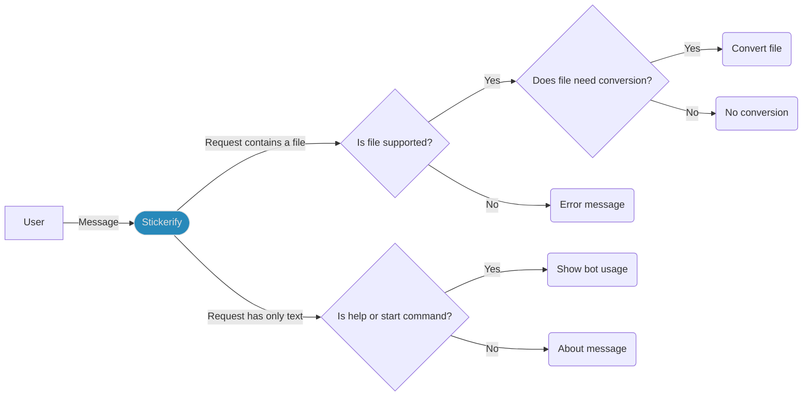

# [Stickerify](https://t.me/StickerifyImageBot)

Telegram bot to convert medias in the format required to be used as Telegram stickers

## Table of contents

* [How to use the bot](#how-to-use-the-bot)
* [How to create a new sticker](#how-to-create-a-new-sticker)
* [How to set up the project](#how-to-set-up-the-project)
* [How to run the bot locally](#how-to-run-the-bot-locally)
* [How to launch the bot using Docker](#how-to-launch-the-bot-using-docker)
* [How to contribute to the project](#how-to-contribute-to-the-project)
* [Hacktoberfest](#hacktoberfest)
* [Useful information](#useful-information)
* [Privacy policy](#privacy-policy)
* [License](#license)

## How to use the bot

You can use the bot going [here](https://t.me/StickerifyImageBot): start it, and you can now send it the medias you need
to convert.

Based on what you send, [Stickerify](https://t.me/StickerifyImageBot) will answer the following:

* the converted media, if you sent a supported file (images, gifs, videos, and existing Telegram stickers are supported)
  that needed conversion
* no file, if you sent a media already suiting Telegram's requirements
* an error message, if you sent either an unsupported or a corrupted file
* an informative message for any message without a file



## How to create a new sticker

1. Chat with [Stickers](https://t.me/Stickers), and use it to create a sticker pack
2. Ask [Stickers](https://t.me/Stickers) to add a new sticker
3. Use [Stickerify](https://t.me/StickerifyImageBot) to create the proper file for your sticker
4. Forward [Stickerify](https://t.me/StickerifyImageBot)'s message to [Stickers](https://t.me/Stickers)
5. Choose an emoji representing your sticker

And it's done!

## How to set up the project

1. Install JDK 23 (or higher)
2. Clone the project and move into its folder
3. Run the command `./gradlew build -x test`
4. Import the project inside your IDE as a Gradle project
5. Ensure your IDE is correctly configured to use a Java 23 (or higher) JDK

## How to run the bot locally

After you successfully set up the project, you will have to go through the following steps:

1. Chat with [BotFather](https://t.me/BotFather) and ask it to create a new bot
2. Copy the token it provided you and either:
    * set it as the value of a new environment variable named `STICKERIFY_TOKEN`
    * use it as the value passed to the `super(botToken)` constructor inside the class `Stickerify`
3. Install [FFmpeg](https://ffmpeg.org/download.html)
4. Run the `Main` class to start the bot, it will be now able to answer messages in Telegram

## How to launch the bot using Docker

1. Install [Docker](https://docs.docker.com/get-docker/)
2. Prepare the Docker image either:
    * moving into the project folder and building the image with the command:

       ```shell
       docker build -t rob93c/stickerify .
       ```

    * pulling the image from [Docker Hub](https://hub.docker.com/):

       ```shell
       docker pull rob93c/stickerify
       ```

3. Now you just need to run the Docker image passing the token (`{{TOKEN}}`) retrieved
   from [BotFather](https://t.me/BotFather):

   ```shell
   docker run -e "STICKERIFY_TOKEN={{TOKEN}}" rob93c/stickerify
   ```

## How to contribute to the project

Take a look at this project's contributing guidelines [here](CONTRIBUTING.md).

Have any question? Consider [opening a new discussion](https://github.com/Stickerifier/Stickerify/discussions/new).

## Hacktoberfest

[Hacktoberfest](https://hacktoberfest.com/) is an event aiming to encourage people to contribute to open-source projects
every October.
This project adheres to this initiative and welcomes any hacktoberfest-related improvement!

If you would like to improve [Stickerify](https://t.me/StickerifyImageBot) as part of this event, first read
the [contributing guidelines](CONTRIBUTING.md) and then consider opening a new issue _and/or_ pull request.

If your pull request represents a valid contribution to the project, it will be marked as `hacktoberfest-accepted`,
therefore counting towards the 4 contributions goal.

## Useful information

* The bot is deployed on [Railway](https://railway.app?referralCode=rob)
* The official documentation of the Telegram Bot API can be found [here](https://core.telegram.org/bots)
* The library used by the bot to work with Telegram is [Java Telegram Bot API](https://github.com/pengrad/java-telegram-bot-api)
* Video conversion uses [FFmpeg](https://ffmpeg.org/) and [JAVE2](https://github.com/a-schild/jave2)
* Image conversion uses [Scrimage](https://github.com/sksamuel/scrimage), [ImageIO](https://docs.oracle.com/en/java/javase/20/docs/api/java.desktop/javax/imageio/ImageIO.html), and [TwelveMonkeys](https://github.com/haraldk/TwelveMonkeys)
* Animated sticker validation uses [Gson](https://github.com/google/gson)
* MIME type analysis is performed using [Apache Tika](https://tika.apache.org/)

## Privacy Policy

The privacy policy can be found [**here**](PRIVACY_POLICY.md).

## License

See the [**LICENSE**](LICENSE) file for license rights and limitations (MIT).
