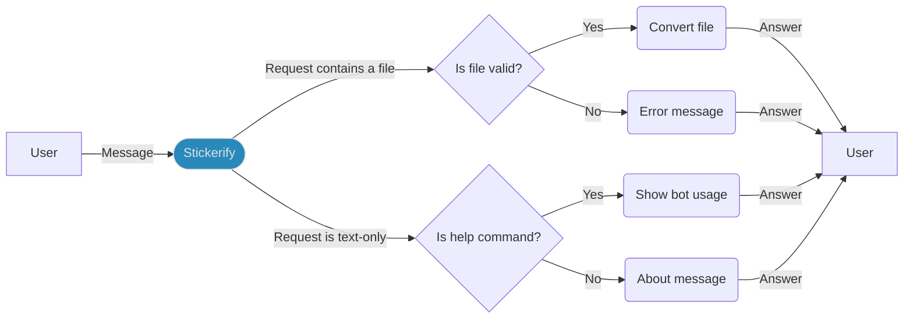

# [Stickerify](https://t.me/StickerifyImageBot)

Telegram bot to convert images in the format required to be used as Telegram stickers (512x512 PNGs)

## Table of contents

* [How to use the bot](#How-to-use-the-bot)
* [How to create a new sticker](#How-to-create-a-new-sticker)
* [How to set up the project](#How-to-set-up-the-project)
* [How to run the bot locally](#How-to-run-the-bot-locally)
* [How to launch the bot using Docker](#How-to-launch-the-bot-using-Docker)
* [How to contribute to the project](#How-to-contribute-to-the-project)
* [Hacktoberfest](#Hacktoberfest)
* [Useful resources](#Useful-resources)
* [License](#License)

## How to use the bot

You can use the bot going [here](https://t.me/StickerifyImageBot): start it, and you can now send it the images you need to convert.

Based on what you send, [Stickerify](https://t.me/StickerifyImageBot) will answer the following:

* the converted image, if you sent a supported file (currently only `.png`, `.jpeg`, and `.webp` files are supported)
* an error message, if you sent an unsupported file
* an informative message for any message without a file



## How to create a new sticker

1. Chat with [Stickers](https://t.me/Stickers), and use it to create a sticker pack
2. Ask [Stickers](https://t.me/Stickers) to add a new sticker
3. Use [Stickerify](https://t.me/StickerifyImageBot) to create the proper file for your sticker
4. Forward [Stickerify](https://t.me/StickerifyImageBot)'s message to [Stickers](https://t.me/Stickers)
5. Choose an emoji representing your sticker

And it's done!

## How to set up the project

1. Install JDK 19 (or higher)
2. Clone the project and move into its folder
3. Run the command `./gradlew build`
4. Import the project inside your IDE as a Gradle project
5. Ensure your IDE is correctly configured to use a Java 19 (or higher) JDK

## How to run the bot locally

After you successfully set up the project, you will have to go through the following steps:

1. Chat with [BotFather](https://t.me/BotFather) and ask it to create a new bot
2. Copy the token it provided you and either:
   * set it as the value of a new environment variable named `STICKERIFY_TOKEN` 
   * use it as the return value of the method `getBotToken()` inside `Stickerify`
3. Run the `Main` class to start the bot, it will be now able to answer messages in Telegram

## How to launch the bot using Docker

1. Install [Docker](https://docs.docker.com/get-docker/)
2. Prepare the Docker image either:
   * building it with the command:
      ```shell
      docker build -t rob93c/stickerify .
      ```
   * pulling the image from [Docker Hub](https://hub.docker.com/):
      ```shell
      docker pull rob93c/stickerify
      ```
3. Now you just need to run the Docker image passing the token (`{{TOKEN}}`) retrieved from [BotFather](https://t.me/BotFather):
   ```shell
   docker run -e "STICKERIFY_TOKEN={{TOKEN}}" rob93c/stickerify
   ```

## How to contribute to the project

Take a look at this project's contributing guidelines [here](CONTRIBUTING.md).

Have any question? Feel free to [open a new discussion](https://github.com/Stickerifier/Stickerify/discussions/new).

## Hacktoberfest

[Hacktoberfest](https://hacktoberfest.com/) is an event aiming to encourage people to contribute to open source projects every October.
This project adheres to this initiative and welcomes any hacktoberfest-related improvement!

If you would like to improve [Stickerify](https://t.me/StickerifyImageBot) as part of this event, first read the [contributing guidelines](CONTRIBUTING.md) and then feel free to open a new issue _and/or_ pull request.

If your pull request represents a valid contribution to the project, it will be marked as `hacktoberfest-accepted`, therefore counting towards the 4 contributions goal.

## Useful resources

* [Telegram Bot API](https://core.telegram.org/bots)
* [TelegramBots Java library](https://github.com/rubenlagus/TelegramBots)
* [Railway](https://railway.app?referralCode=rob)
* [Apache Tika](https://tika.apache.org/)

## License

See the [**LICENSE**](LICENSE) file for license rights and limitations (MIT).

<div align="right">
    <sup>made with 💖 by <a href="https://github.com/rob93c">Roberto Cella</a></sup>
</div>
